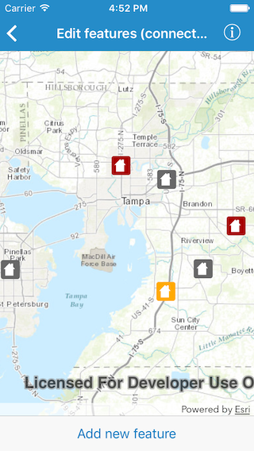
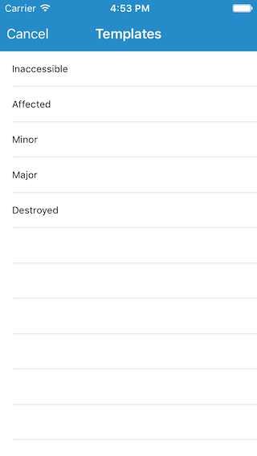
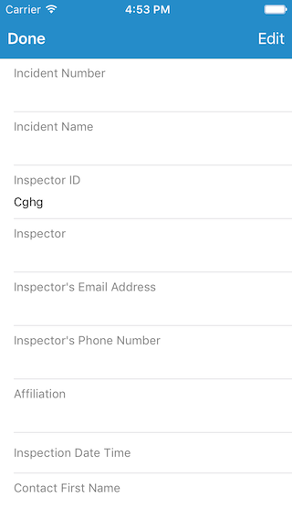

#Edit features (connected)

This sample demonstrates how you can use popups to edit features in a feature layer

##How to use the sample

Browse feature:
Tap on a feature to display the popup. The popup may contain information about a number of features depending on the density of features at the tapped location. It lists the attributes and attachments for each feature. You can enable the editing mode by tapping on the `Edit` button. In this mode you can edit attribute values, change geometry, add or view or delete attachments or delete the feature. To exit the editing mode you can either tap on `Cancel`, which would ignore all the changes, or tap on `Done`, which would save all the changes you made during the edit session.

Add feature:
Tap on the `Add new feature` in the bottom toolbar to initiate adding a feature. You would be shown a list of feature templates, already available. Picking one would open the popup for the new feature in the editing mode. You can use the geometry button the on bottom left to specify the location for the new feature. Once you are finished updating the attributes or attachments you can tap on the `Done` button to save the feature or on `Cancel` button to discard.

##How it works

The sample uses the `AGSPopupsViewController` to display the container view controller and `AGSPopup` objects to populate the container. The map view controller conforms to the `AGSPopupsViewControllerDelegate` for events like interaction or editing or deletion. For feature templates or feature types it uses the `featureTemplates` and `featureTypes` property on the `AGSServiceFeatureTable` associated with the feature layer. To create a feature from selected template it uses the `createFeature(with:)`, `add(_:completion:)`, `applyEdits(completion:)` methods, again on the service feature table.

