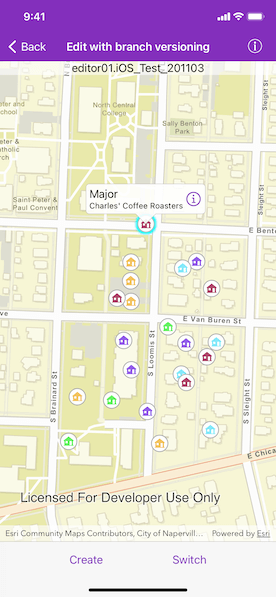

# Edit with branch versioning

Create, query and edit a specific server version using service geodatabase.

## Use case

Workflows often progress in discrete stages, with each stage requiring the allocation of a different set of resources and business rules. Typically, each stage in the overall process represents a single unit of work, such as a work order or job. To manage these, you can create a separate, isolated version and modify it. Once this work is complete, you can integrate the changes into the default version.

## How to use the sample

Upon opening the sample, you will be prompted to enter credentials for the service. Once loaded, the map will zoom to the extent of the feature layer. The current version is indicated at the top of the map. Tap "Create" to open a dialog to specify the version information (name, access, and description). See the *Additional information* section for restrictions on the version name.

Create the version with the information that you specified. Select a feature to edit an attribute and/or tap a second time to relocate the point.

Tap "Switch" to switch between the version you created and the default version. Edits will automatically be applied to your version when switching to the default version.

## How it works

1. Create and load an `AGSServiceGeodatabase` with a feature service URL that has enabled version management.
2. Get the `AGSServiceFeatureTable` from the service geodatabase.
3. Create an `AGSFeatureLayer` from the service feature table.
4. Create `AGSServiceVersionParameters` with a unique name, `AGSVersionAccess`, and description.
    * Note - See the additional information section for more restrictions on the version name.
5. Create a new version calling `AGSServiceGeodatabase.createVersion(with:completion:)`, passing in the service version parameters.
6. Upon finish, get the `AGSServiceVersionInfo` of the version created.
7. Switch to the version you have just created calling `AGSServiceGeodatabase.switchVersion(withName:completion:)`, passing in the version name obtained from the service version info from the step above.
8. Select an `AGSFeature` to edit its "typdamage" attribute and location.
9. Apply these edits to your version by calling `AGSServiceGeodatabase.applyEdits(completion:)`.
10. Switch back and forth between your versions and the default version to see how the versions differ.

## Relevant API

* AGSFeatureLayer
* AGSServiceFeatureTable
* AGSServiceGeodatabase
* AGSServiceVersionInfo
* AGSServiceVersionParameters
* AGSVersionAccess

## About the data

The feature service in this sample is [Damage to commercial buildings](https://sampleserver7.arcgisonline.com/arcgis/rest/services/DamageAssessment/FeatureServer/0) located in Naperville, Illinois.

## Additional information

The credentials for testing purpose

* username: editor01
* password: editor01.password

The name of the version must meet the following criteria

1. Must not exceed 62 characters
2. Must not include: Period (.), Semicolon (;), Single quotation mark ('), Double quotation mark (")
3. Must not include a space for the first character

* Note - the version name will have the username and a period (.) prepended to it, e.g "editor01.MyNewUniqueVersionName".

Branch versioning access permission

1. Public - Any portal user can view and edit the version.
2. Protected - Any portal user can view, but only the version owner, feature layer owner, and portal administrator can edit the version.
3. Private - Only the version owner, feature layer owner, and portal administrator can view and edit the version.

## Tags

branch versioning, edit, version control, version management server
