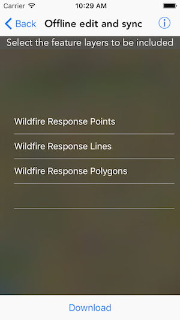

#Offline edit and sync

This sample demonstrates how you can take feature service data offline by creating a geodatabase, make edits and sync changes

##How to use the sample

At start the sample is showing features from the service. When you tap on the `Generate geodatabase` button in the bottom toolbar, you are asked to choose the extent for the geodatbase and the layers you would like to include. Once the geodatabase is downloaded, all its layers are shown in the map view. You can tap on a feature to get the popup view. Inside which you can make edits. The label on the top should specify the number of edits. You can sync the changes by tapping on the `Sync` button. Once the changes are synced you can switch back to the service and verify the changes.

##How it works

The sample uses the `generateJob(with:downloadFileURL:)` method on  `AGSGeodatabaseSyncTask` to create an `AGSJob`. The `start(statusHandler:completion:)` method on the job, starts the generation process, provides status updates and the geodatabase on successful completion. The sample also uses the `AGSPopupsViewController` to display the view controller and `AGSPopup` objects to populate the controller. The map view controller conforms to the `AGSPopupsViewControllerDelegate` for events like interaction or editing or deletion. 

