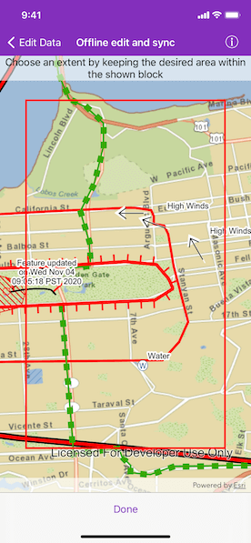
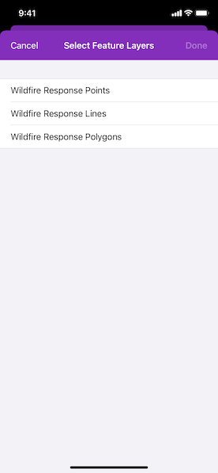
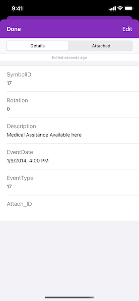

# Offline edit and sync

Synchronize offline edits with a feature service using a popup.

## Use case

A survey worker who works in an area without an internet connection could take a geodatabase of survey features offline at their office, make edits and add new features to the offline geodatabase in the field, and sync the updates with the online feature service after returning to the office.

## How to use the sample

Tap the "Generate Geodatabase" button and then pan and zoom to position the red rectangle around the area to be taken offline. Tap "Done" and choose the feature layers to take the area and features offline. To edit features, tap to select a feature, and use the popup to edit the attributes. To sync the edits with the feature service, tap the "Sync" button. Tap "Switch to service" to reload the service area.

## How it works

1. Create an `AGSGeodatabaseSyncTask` from a URL to a feature service.
2. Generate the geodatabase sync task with default parameters using `AGSGeodatabaseSyncTask.defaultGenerateGeodatabaseParameters(withExtent:completion:)`.
3. Create an `AGSGenerateGeodatabaseJob` object with `AGSGeodatabaseSyncTask.generateJob(with:downloadFileURL:)`, passing in the parameters and a path to where the geodatabase should be downloaded locally.
4. Start the job and get a geodatabase as a result.
5. Set the sync direction to `.bidirectional`.
6. To enable editing, load the geodatabase and get its feature tables. Create feature layers from the feature tables and add them to the map's operational layers collection.
7. Create an `AGSGeodatabaseSyncTask.syncJob(with:geodatabase:)` passing in the parameters and geodatabase as arguments.
8. Start the sync job to synchronize the edits.
9. To switch to service mode, unregister the geodatabase using `AGSGeodatabaseSyncTask.unregisterGeodatabase(_:completion:)`.

## Relevant API

* AGSFeatureLayer
* AGSFeatureTable
* AGSGenerateGeodatabaseJob
* AGSGenerateGeodatabaseParameters
* AGSGeodatabaseSyncTask
* AGSSyncGeodatabaseJob
* AGSSyncGeodatabaseParameters
* AGSSyncLayerOption

## About the data

The basemap uses an offline tile package of San Francisco. The online feature service has features with wildfire information.

## Tags

feature service, geodatabase, offline, synchronize
