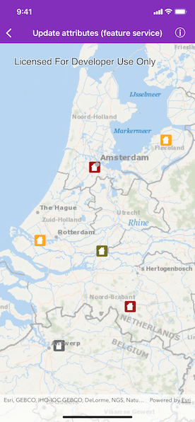
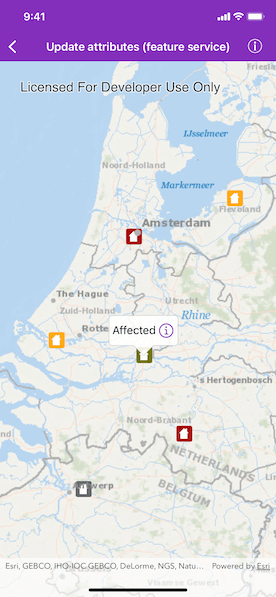
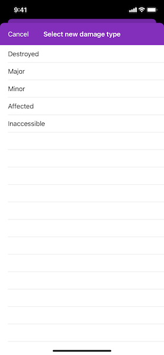
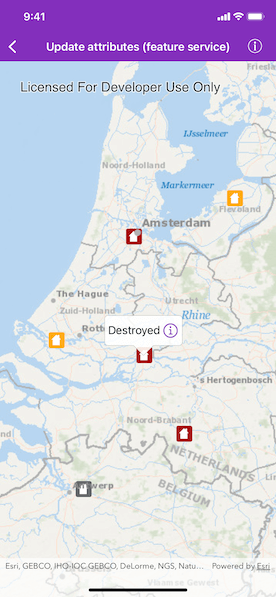

# Update attributes (feature service)

Update feature attributes in an online feature service.

## Use case

Online feature services can be updated with new data. This is useful for updating existing data in real time while working in the field.

## How to use the sample

To change the feature's damage property, tap the feature to select it, tap the icon in the callout, then choose a new damage type.

## How it works

1. Create an `AGSServiceFeatureTable` object from a URL.
2. Create an `AGSFeatureLayer` object from the `AGSServiceFeatureTable`.
3. Select features from the `AGSFeatureLayer`.
4. Change the selected feature's attributes.
5. Update the table with `AGSFeatureTable.update(_:completion:)`.
6. After a change, apply the changes on the server using `AGSServiceFeatureTable.applyEdits(completion:)`.

## Relevant API

* AGSArcGISFeature
* AGSFeatureLayer
* AGSServiceFeatureTable

## Tags

amend, attribute, details, edit, editing, information, value

