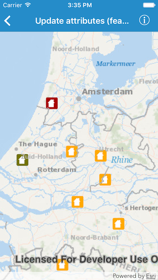
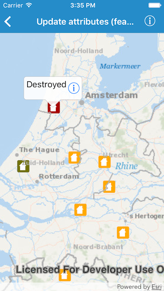
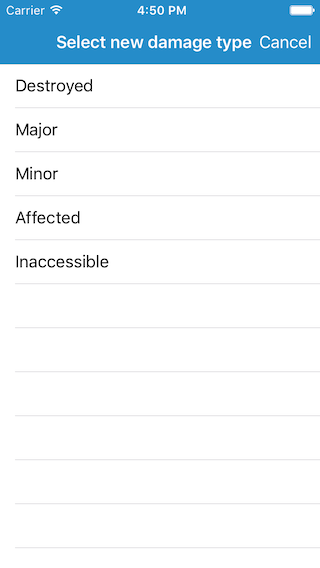
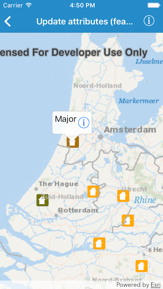

#Update attributes (feature service)

This sample demonstrates how to edit attributes of feature in a feature layer.

##How to use the sample

Features in the map represent properties. Tapping on a property displays the callout. Callout contains information about the type of damage on that property. In order to change the type of damage, you would have to tap on the information button in the callout. Doing so, would display a list of values to choose from. Selecting one would dismiss the list and update the damage type for the selected property.

##How it works

The sample uses the `attributes[forKey:]` method on `AGSFeature` to get the current damage type for a selected property and displays it in the callout. On selection of a new damage type, the app sets the new value using the `setAttributeValue[forKey:]` method. And in order to apply the changes to the service it uses `applyEdits(completion:)` on the `AGSServiceFeatureTable` for the feature.

