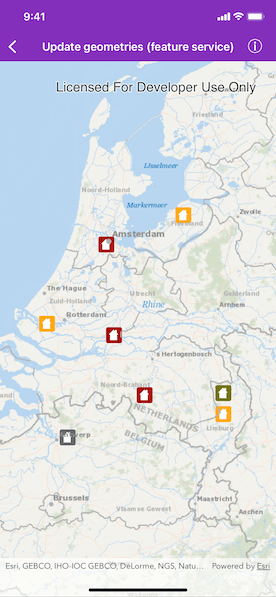
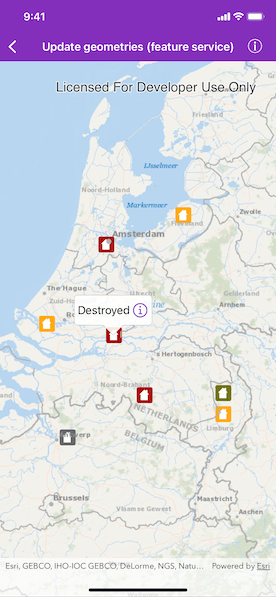
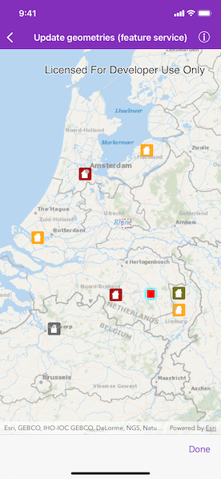

# Update geometries (feature service)

Update a feature's location in an online feature service.

## Use case

Sometimes users may want to edit features in an online feature service by moving them.

## How to use the sample

Tap a feature to select it. Tap the icon in the callout to begin updating the geometry. Tap the feature to select it, then tap on the map to update the geometry. Tap the "Done" button to complete the changes. An alert will be shown confirming success or failure.

## How it works

1. Create and load an `AGSServiceGeodatabase` with a feature service URL.
2. Get the `AGSServiceFeatureTable` from the service geodatabase.
3. Create an `AGSFeatureLayer` from the service feature table.
4. Find the layer of the selected feature using `AGSGeoView.identifyLayer(_:screenPoint:tolerance:returnPopupsOnly:maximumResults:completion:)`, which returns an `AGSIdentifyLayerResult` used to get the selected feature.
5. Change the selected feature's `AGSFeature.geometry` to change its location.
6. Apply edits to the `AGSServiceGeodatabase` by calling `AGSServiceGeodatabase.applyEdits(completion:)`, which will update the feature's geometry on the online service.

## Relevant API

* AGSFeature
* AGSFeatureLayer
* AGSServiceFeatureTable
* AGSServiceGeodatabase

## Tags

editing, feature layer, feature table, moving, service, updating
