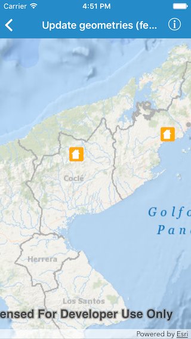
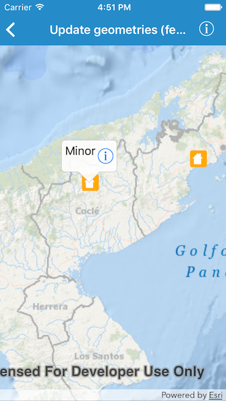
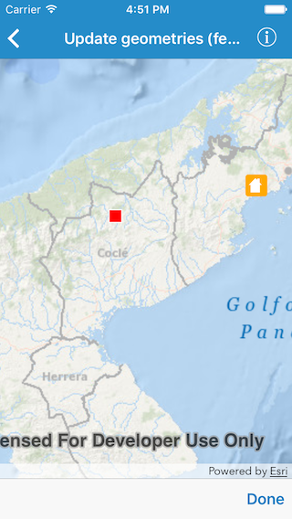
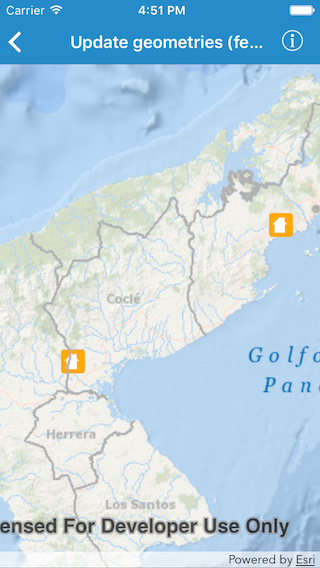

#Update geometries (feature service)

The sample demonstrates how to update geometry of a feature in a feature layer.

##How to use the sample

Tapping on a feature on the map displays the callout. Tapping on the info button in the callout lets you edit geometry for that feature. The current geometry of the feature is depicted using a circular marker symbol. You can tap on a new location and tap `Done`, in order to save the new geometry.

##How it works

When you tap on the info button in the callout, the app gets the geometry for the selected feature using the `geometry` property on `AGSFeature`. It hides the feature from the feature layer and add the geometry to a sketch layer (with red marker symbol). The sketch layer allows you to select a new geometry. When you tap `Done`, assigns the new geometry to the `geometry` property on the feature. And in order to apply edits to the service, calls `applyEdits(completion:)` on the service feature table.

