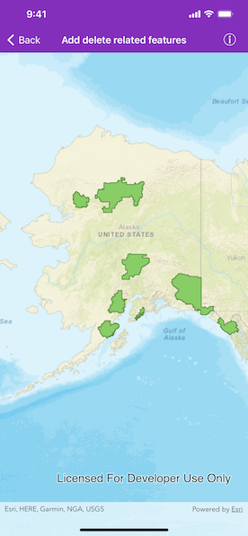
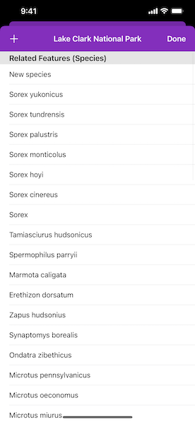

# Add delete related features

Add or delete related features on an origin feature.

## Use case

Adding or deleting related features is a helpful workflow when you have two features with shared or dependent attributes. In this scenario, you can add or remove to a list of species that exist within a national park.

## How to use the sample

Tap on a park in the map view. A list of species as related features will be shown. Tap on the top left button to add a new species to the park. Drag a row from right to left to delete a species from the park.

## How it works

1. Create an `AGSServiceFeatureTable` from a URL.
2. Create an `AGSFeatureLayer` from the service feature table.
3. Add the feature layer to the map's `operationalLayers` array.
4. Add a related feature by using the `AGSFeatureTable.createFeature(attributes:geometry:)` method on the the related feature table.
5. Relate the new feature to the origin feature using the `AGSArcGISFeature.relate(to:)` method on `AGSFeature` then add it to the related feature table.
6. To delete a related feature, use the `delete(_:completion:)` method on the related feature table.
7. Apply the edits using `applyEdits(completion:)` on the feature table.

## Relevant API

* AGSArcGISFeature.relate(to:)
* AGSFeatureLayer
* AGSFeatureTable.createFeature
* AGSServiceFeatureTable

## Tags
editing, features, service, updating
