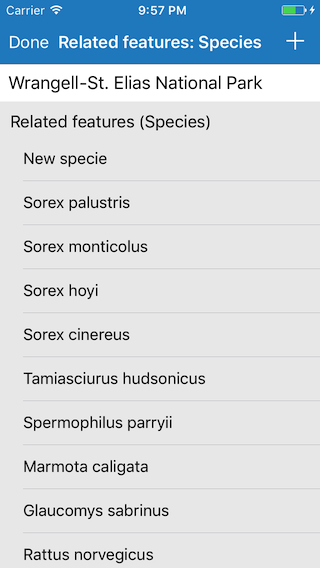

# Add delete related features

This sample demonstrates how to add or delete related features on an origin feature.

## How to use the sample

Tap on a park in the map view. A list of species as related features will be shown. Tap on the `+` plus on the top right to add a new specie to the park. Drag a row from right to left to delete a specie from the park.

## How it works

To add a related feature, the sample uses `createFeature(attributes:geometry:)` method on the related feature table `AGSServiceFeatureTable`. The new feature is then related to the origin feature using `relate(to:)` method on `AGSFeature`. Then its added to the related feature table using `add(_:completion:)` method.

Similary, to delete a related feature, the sample uses `delete(_:completion:)` method on the related feature table `AGSServiceFeatureTable`. The changes are applied to the service by calling `applyEdits(completion:)` on the feature table when tapped on the `Done` button.

