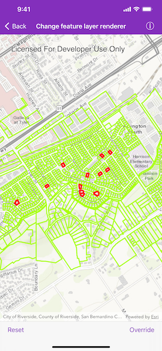
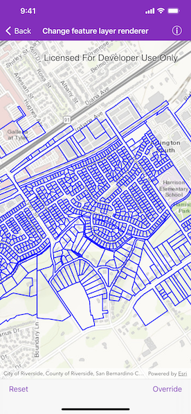

# Change feature layer renderer

Change the appearance of a feature layer with a renderer.

## How to use the sample

Use the buttons in the bottom toolbar to override or reset the renderer.

## Use case

A feature layer hosted on ArcGIS Online has a preset renderer and will display in an ArcGIS Runtime application with that renderer. However, for example, the color associated with the original renderer may be unsuitable for a company with staff or clients who are color blind, or for presentation with a different set of basemap and operational layers. In these cases, the renderer on the feature layer's data can be set to a more suitable color.

## How to use the sample

Tap the bottom right button in the toolbar to change the renderer on the feature layer. The original renderer displays red and green outlines. The override renderer displays blue outlines. Tap the bottom left button to reset to the original renderer. 

## How it works

1. Create an `AGSServiceFeatureTable` from a URL.
2. Create an `AGSFeatureLayer` from the service feature table.
3. Create a line symbol using `AGSSimpleLineSymbol`.
4. Create a new renderer (in this case, an `AGSSimpleRenderer`) with the line symbol.
5. Update the feature layer's `AGSRenderer`.

## Relevant API

* AGSFeatureLayer.resetRenderer
* AGSServiceFeatureTable
* AGSSimpleRenderer

## About the data

This sample displays a feature layer in Riverside, California, displaying which parcels do not have pool permits. 

## Tags

feature layer, renderer, visualization
