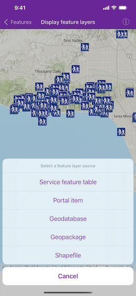

# Display feature layers

Display feature layers from various data sources.

## Use case

Feature services are useful for sharing vector GIS data with clients so that individual features can be queried, displayed, and edited. There are various online and offline methods to load feature services. 

## How to use the sample

Tap the button on the toolbar to explore various methods of loading a feature layer. Pan and zoom the map to view the feature layers.

## How it works

1. Set the basemap with an `AGSBasemapStyle`.
2. Load a feature layer with a URL.  
    i. Create an `AGSServiceFeatureTable` from a URL.  
    ii. Create an `AGSFeatureLayer` with the feature table.  
3. Load a feature layer with a portal item.  
    i. Create an `AGSPortalItem` with the portal and item ID.  
    ii. Create an `AGSFeatureLayer` with the portal item and layer ID.  
4. Load a feature layer with a geodatabase.  
    i. Instantiate and load an `AGSGeodatabase` using the file name.  
    ii. Get the feature table from the geodatabase with the feature table's name.  
    iii. Create an `AGSFeatureLayer` from the feature table.  
5. Load a feature layer with a geopackage.  
    i. Instantiate and load a geopackage using its file name.  
    ii. Get the first `AGSGeoPackageFeatureTable` from the `geoPackageFeatureTables` array.  
    iii. Create an `AGSFeatureLayer` from the feature table.  
6. Load a feature layer with a shapefile.  
    i. Create an `AGSShapefileFeatureTable` using its file name.  
    ii. Create an `AGSFeatureLayer` from the feature table and load it.  
7. Add the feature layer to the map's `operationalLayers`.  

## Relevant API

* AGSFeatureLayer
* AGSGeodatabase
* AGSGeoPackageFeatureTable
* AGSPortalItem
* AGSServiceFeatureTable
* AGSShapefileFeatureTable

## About the data

This sample uses the [Outcrop (Polygon) service](https://sampleserver6.arcgisonline.com/arcgis/rest/services/Energy/Geology/FeatureServer/9), [Trees of Portland](https://www.arcgis.com/home/item.html?id=1759fd3e8a324358a0c58d9a687a8578), [Los Angeles Trailheads geodatabase](https://www.arcgis.com/home/item.html?id=2b0f9e17105847809dfeb04e3cad69e0), [Aurora, Colorado GeoPackage](https://www.arcgis.com/home/item.html?id=68ec42517cdd439e81b036210483e8e7), and [Scottish Trust Wildlife Reserves Shapefile](https://www.arcgis.com/home/item.html?id=15a7cbd3af1e47cfa5d2c6b93dc44fc2). 

Data © Scottish Wildlife Trust (2022).

This data is provided from Scottish Wildlife Trust under [CC-BY licence](https://creativecommons.org/licenses/by/4.0/).

## Tags

feature, geodatabase, geopackage, layers, table, service, shapefile
