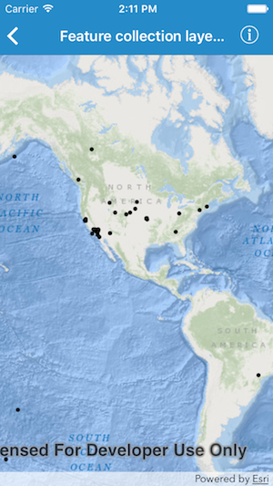

#Feature collection layer (query)

This sample demonstrates how to create a feature collection layer to show a query result from a service feature table. The feature collection is then displayed on the map with a feature collection layer.

##How it works

A query is performed using `queryFeatures(with:completion:)` method on `AGSServiceFeatureTable`. The result of the query is used to instantiate an `AGSFeatureCollectionTable`. The table is used to instantiate an `AGSFeatureCollection` which is then use to initialize an `AGSFeatureCollectionLayer`. The layer is then displayed on the map by adding it to the operational layers array.

