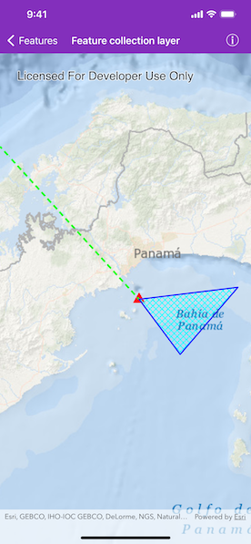

# Feature collection layer

Create a feature collection layer from a feature collection table and add it to a map.

## Use case

A feature collection allows easily importing external data, such as CSV files, as well as creating custom schema for data that is in non-standardized format. This data can then be used to populate a feature collection table and be displayed in a feature collection layer using the attributes and geometries provided in the external data source. For example, an electricity supplier could use this functionality to visualize existing location data of coverage areas (polygons), power stations (points), transmission lines (polylines), and others.

## How to use the sample

When launched, this sample displays an `AGSFeatureCollectionLayer` with an `AGSPoint`, `AGSPolyline` and `AGSPolygon` geometry. Pan and zoom to explore the scene.

## How it works

1. Create an `AGSFeatureCollectionTable` for each of the geometry types `AGSPoint`, `AGSPolyline`, and `AGSPolygon` using `AGSFeatureCollectionTable.init(fields:geometryType:spatialReference:)`.  
    i. Create the schema for each feature collection table by creating an array of `AGSField`s.    
    ii. Create an `AGSFeatureCollectionTable` with the fields created.  
    iii. Create an `AGSSimpleRenderer` from an `AGSSimpleMarkerSymbol`.  
    iv. Create a new point feature using `AGSFeatureTable.createFeature()`.  
    v. Add the feature to the `AGSFeatureCollectionTable`.  
2. Create an `AGSFeatureCollection` from the `AGSFeatureCollectionTable`s.
3. Create an `AGSFeatureCollectionLayer` using the `AGSFeatureCollection`.
4. Add the feature collection layer to the map's, `operationalLayers`.

## Relevant API

* AGSFeature
* AGSFeatureCollection
* AGSFeatureCollectionLayer
* AGSFeatureCollectionTable
* AGSField
* AGSSimpleRenderer

## Tags

collection, feature, layers, table
