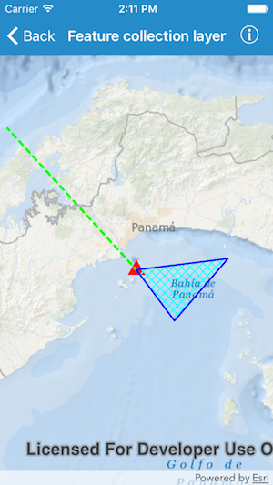

# Feature collection layer

This sample demonstrates how to create a new feature collection with three feature collection tables (containing points, lines, and polygons). Features are added programmatically and the collection is displayed in the map as a feature collection layer.

## How it works

An `AGSFeatureCollectionLayer` is created from an `AGSFeatureCollection` and is added to the map's operational layers. Then, a point `AGSFeatureCollectionTable`, a polyline `AGSFeatureCollectionTable`, and a polygon `AGSFeatureCollectionTable` are created, and their schemas and renderers are defined. Next, features are added to each table, and each table is added to the `AGSFeatureCollection`. In this case, hardcoded features are added to the tables for display on the map. However, a common use case is to read a CSV or some other data source, and to popuplate the table with the attributes and geometry provided in the external data source.

