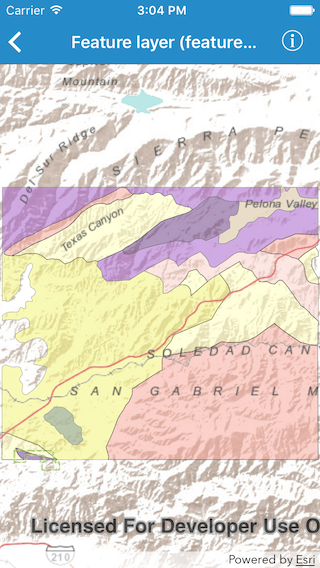

#Feature layer (feature service)

This sample demonstrates how to show a feature layer on a map using the URL to the service

##How it works

The sample creates an instance of `AGSServiceFeatureTable` using the initializer `initWithURL:`. Then creates a `AGSFeatureLayer` object using the initializer `initWithFeatureTable:`

