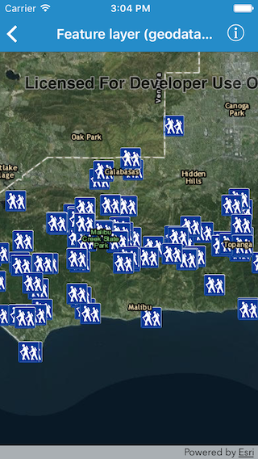

#Feature layer (geodatabase)

This sample demonstrates how to show a feature layer on a map using a geodatabase

##How it works

The sample creates an instance of `AGSGeodatabase` using the initializer `initWithName:`. The geodatabase with specified name is already added to the bundle. The sample then loads the geodatabase for the feature tables. It gets the table with specified and uses that to create a feature layer. The feature layer is then added to the list of operational layers on the map.

