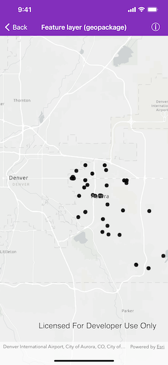

# Feature layer (geopackage)

Display features from a local GeoPackage.

## Use case

A GeoPackage is an OGC standard, making it useful when your project requires an open source data format or when other, non-ArcGIS systems may be creating the data. Accessing data from a local GeoPackage is useful when working in an environment that has an inconsistent internet connection or that does not have an internet connection at all. For example, a department of transportation field worker might source map data from a GeoPackage when conducting signage inspections in rural areas with poor network coverage.

## How to use the sample

Pan and zoom around the map. View the data loaded from the geopackage.

## How it works

1. Create an `AGSGeoPackage` using the provided local resource, `AuroraCO`.
2. Load the `AGSGeoPackage` with `AGSGeoPackage.load(completion:)`.
3. When it's done loading, get the first feature layer from the `AGSGeoPackage`s array of `AGSGeoPackageFeatureTables`.
4. Create an `AGSFeatureLayer` for the first `AGSFeatureTable`. 
5. Add it to the map's array of `operationalLayers`.

## Relevant API

* AGSFeatureLayer
* AGSGeoPackage
* AGSGeoPackageFeatureTable
* AGSMap

## Offline data

This sample uses the [Aurora, Colorado GeoPackage](https://www.arcgis.com/home/item.html?id=68ec42517cdd439e81b036210483e8e7). It is downloaded from ArcGIS Online automatically.

## About the data

The map shows point locations of public art installations in Aurora, Colorado.

## Tags

feature table, geopackage, gpkg, OGC, package, standards
