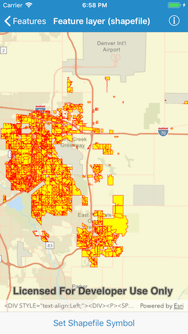

# Feature Layer (Shapefile)

This sample demonstrates how to display a FeatureLayer from a shapefile.

## How it works

The sample creates an `AGSShapefileFeatureTable` using the initializer `init(name:)` where the name refers to a shapefile that has been included in the application bundle. The shapefile feature table is used to instantiate an `AGSFeatureLayer` which is added to the operational layers of a map. The map view is then zoomed to the shapefile's full extent.

 