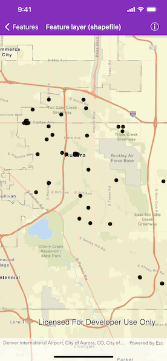

# Feature Layer (Shapefile)

Open a shapefile stored on the device and display it as a feature layer with default symbology.

## Use case

Shapefiles store location, shape and attributes of geospatial vector data. Shapefiles can be loaded directly into ArcGIS Runtime.

## How to use the sample

When launched, the sample displays shapefiles from Aurora, Colorado. Pan and zoom to explore.

## How it works

1. Create an `AGSShapefileFeatureTable` using the name of the local file, `Public_Art`.
2. Create an `AGSFeatureLayer` using the shapefile feature table.
3. Add the layer to the map's `operationalLayers`.

## Relevant API

* AGSFeatureLayer
* AGSShapefileFeatureTable

## Offline data

This sample uses the [Public Art Shapefile](https://www.arcgis.com/home/item.html?id=d98b3e5293834c5f852f13c569930caa). It is downloaded from ArcGIS Online automatically.

## Tags

layers, shapefile, shp, vector
