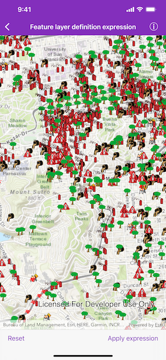
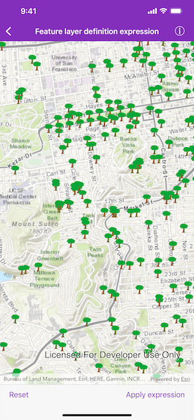

# Feature layer definition expression

Limit the features displayed on a map with a definition expression. 

## Use case

Set a definition expression to filter out the features to be displayed. You might filter a dataset of tree quality selecting for only those trees which require maintenance or are damaged.

## How to use the sample

Tap the "Apply expression" button to limit the features requested from the feature layer to those specified by the SQL query definition expression. Tap the "Reset" button to remove the definition expression on the feature layer, which returns all the records.

## How it works

1. Create an `AGSServiceFeatureTable` from a URL.
2. Create an `AGSFeatureLayer` from the service feature table.
3. Add an `AGSDefinitionExpression` to show specific features only.

## Relevant API

* AGSDefinitionExpression
* AGSFeatureLayer
* AGSServiceFeatureTable

## About the data

This map displays point features related to crime incidents that have been reported by city residents.

## Tags

definition expression, filter, limit data, query, restrict data, SQL, where clause
