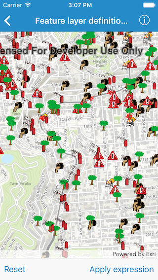

#Feature layer definition expression

This sample demonstrates how you can limit which features to display on the map.

##How to use the sample

Use the buttons in the bottom toolbar to apply or reset definition expression.

##How it works

You can achieve this by setting the `definitionExpression` property on an `AGSFeatureLayer`. It is the syntax of a SQL where clause by which to limit which features are displayed on the map.

