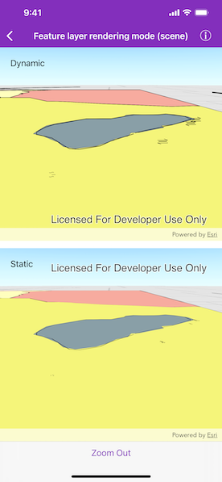

# Feature layer rendering mode (scene)

Render features in a scene statically or dynamically by setting the feature layer rendering mode.

## Use case

In dynamic rendering mode, features and graphics are stored on the GPU. As a result, dynamic rendering mode is good for moving objects and for maintaining graphical fidelity during extent changes, since individual graphic changes can be efficiently applied directly to the GPU state. This gives the map or scene a seamless look and feel when interacting with it. The number of features and graphics has a direct impact on GPU resources, so large numbers of features or graphics can affect the responsiveness of maps or scenes to user interaction. Ultimately, the number and complexity of features and graphics that can be rendered in dynamic rendering mode is dependent on the power and memory of the device's GPU.

In static rendering mode, features and graphics are rendered only when needed (for example, after an extent change) and offloads a significant portion of the graphical processing onto the CPU. As a result, less work is required by the GPU to draw the graphics, and the GPU can spend its resources on keeping the UI interactive. Use this mode for stationary graphics, complex geometries, and very large numbers of features or graphics. The number of features and graphics has little impact on frame render time, meaning it scales well, and pushes a constant GPU payload. However, rendering updates is CPU and system memory intensive, which can have an impact on device battery life.

## How to use the sample

Use the "Zoom In" button to trigger the same zoom animation on both static and dynamicly rendered scenes.

## How it works

1. Create an `AGSSceneView` for each staic and dynamic mode and create an `AGSScene` for each.
2. Create `AGSServiceFeatureTable`s using point, polyline, and polygon services.
3. Create an `AGSFeatureLayer` for each of the feature tables and a copy of each feature layer. 
4. Set each feature layer's `renderingMode` to `dynamic` and `static` appropriately. 
5. Add all of the feature layers to the scene's `operationalLayers`.

## Relevant API

* AGSScene
* AGSFeatureLayer
* AGSFeatureLayer.renderingMode
* AGSSceneView

## Tags

3D, dynamic, feature layer, features, rendering, static
