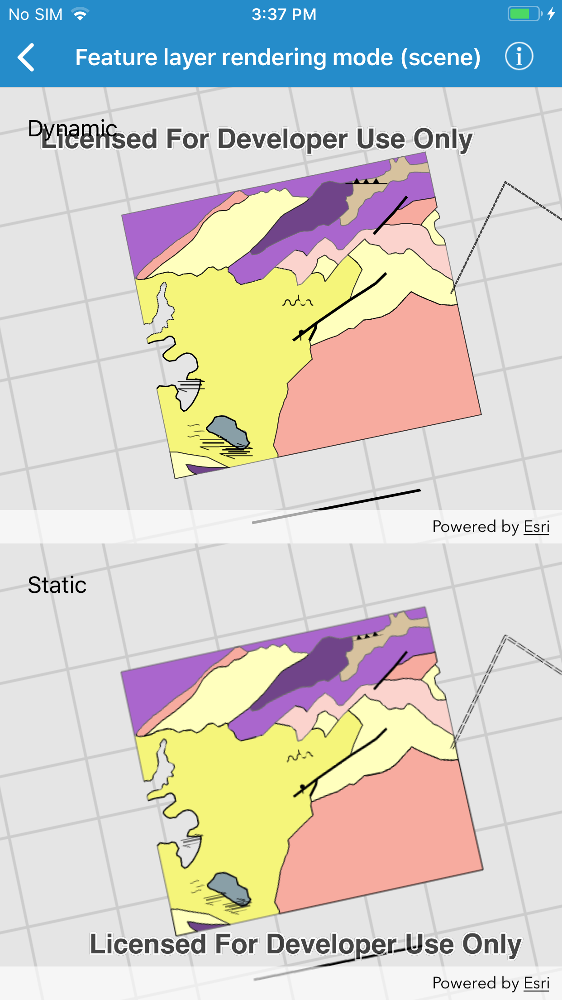

# Feature layer rendering mode (scene)

This sample demonstrates how to set the rendering mode for feature layers in a scene. There are two rendering modes, static and dynamic.

## How to use the sample

The sample shows two `AGSSceneView`s, each showing the same set of feature layers. The feature layers in the top view are in dynamic mode, and the layers in the bottom view are in static mode. Use the button in the bottom toolbar to zoom the views in and out. Observe the differences in how the layers are rendered in each view as they animate.

## How it works

You can set the `renderingMode` on an `AGSFeatureLayer` to one of two options:

* `AGSFeatureRenderingMode.static` - the content is re-rendered intermittently
* `AGSFeatureRenderingMode.dynamic` - the content is re-rendered continuously as the view is animating
