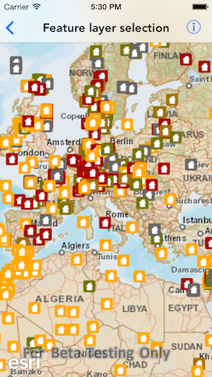
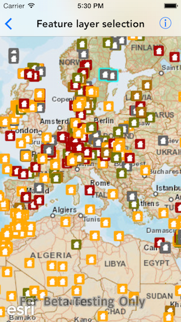

# Feature layer selection

This sample demonstrates how to select features in a feature layer

## How to use the sample

Tap on a feature on the map to select it

## How it works

`AGSGeoViewDelegate` provides a method called `geoView(_:didTapAtScreenPoint:mapPoint:)`, which is fired every time the user taps on the map. The app uses the `mapPoint` passed in the method and creates an envelope around that point based on the tolerance. It then creates an `AGSQueryParameter` object and sets it `geometry` property to the envelope it just created. This query parameter object signifies all the features present in that area/envelope. It then calls the `selectFeatures(withQuery:mode:completion)` by passing the query object to select those features.

