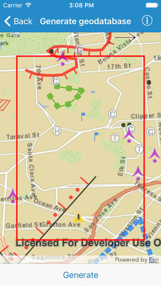

#Generate geodatabase

This sample demonstrates how to take a feature service offline by generating a geodatabase

##How to use the sample

Pan and zoom to the area you want to download features for. Make sure the area is within the red block. Tap on the generate button and it should start the process. Once finished the map view will show the features from the geodatabase. And since this sample won’t be editing and syncing changes back to the service, it unregisters the geodatabase as a good practice.

##How it works

The sample uses the `generateJob(with:downloadFileURL:)` method on  `AGSGeodatabaseSyncTask` to create an `AGSJob`. The `start(statusHandler:completion:)` method on the job, starts the generation process, provides status updates and the geodatabase on successful completion. The sample also uses the `unregisterGeodatabase(_:completion:)` method on sync task to unregister the geodatabase.

