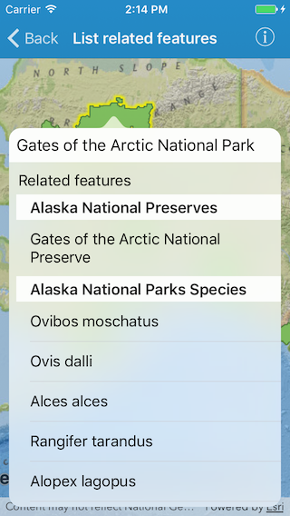

# List related features

This sample demonstrates how to query related features for a given feature.

## How to use the sample

Tap on a feature on the map to see a list of related features.

## How it works

The sample is preloaded with layers from a feature service. The relationships among the layers are defined in the service. The origin layer is shown on the map as an operational layer. The related layers are added as tables to the map. As you tap on the map, `geoView(_:didTapAtScreenPoint:mapPoint:)` touch delegate method is invoked. Inside this method, an identify operation is performed to get features at the tapped location using `identifyLayer(_:screenPoint:tolerance:returnPopupsOnly:completion:)` method on `AGSMapView`. If a feature is found, then the related features for that feature are queried using `queryRelatedFeaturesForFeature(_:completion:)` method on its feature table. The results from the query are shown as a list in popover.

