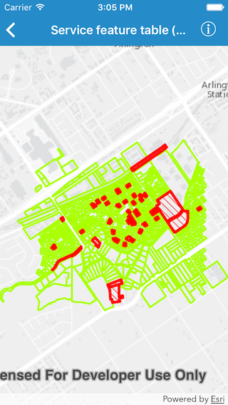

#Service feature table (cache)

This sample demonstrates how to use a feature service in on interaction cache mode.

##How it works

By setting the `featureRequestMode` to `AGSFeatureRequestMode.onInteractionCache` on an `AGSServiceFeatureTable`.
