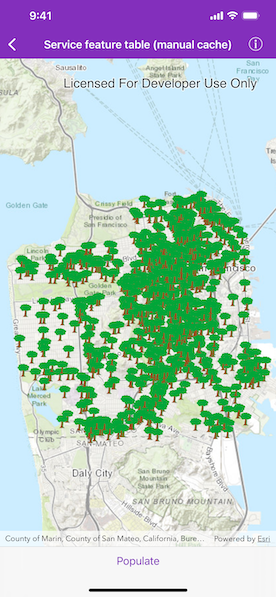

# Service feature table (manual cache)

Display a feature layer from a service using the **manual cache** feature request mode.

## Use case

`AGSServiceFeatureTable` supports three request modes, which define how features are requested from the service and stored in the local table. The feature request modes have different performance characteristics. Use **manual cache** AGSin scenarios where you want to explicitly control requests for features. See [Table performance concepts](https://developers.arcgis.com/ios/latest/swift/guide/layers.htm#ESRI_SECTION1_40F10593308A4718971C9A8F5FB9EC7D) to learn more.

## How to use the sample

Run the sample and pan and zoom around the map. No features will be requested and displayed automatically. Tap the Populate button, and features will display.

## How it works

1. Set the `featureRequestMode` property of the `AGSServiceFeatureTable` to `AGSFeatureRequestMode.onInteractionCache` before the table is loaded.
2. Load the table.
3. Use `AGSServiceFeatureTable.populateFromService(with:clearCache:outFields:completion:)` on the table to request features.

## Relevant API

* AGSFeatureLayer
* AGSFeatureRequestMode
* AGSFeatureRequestMode.manualCache
* AGSServiceFeatureTable
* AGSServiceFeatureTable.populateFromService
* AGSServiceFeatureTable.featureRequestMode

## About the data

This sample uses the [Incidents in San Francisco](https://sampleserver6.arcgisonline.com/arcgis/rest/services/SF311/FeatureServer/0) feature layer. The sample opens with an initial visible extent centered over San Francisco, CA.

## Additional information

In **manual cache** AGSmode, features are never automatically populated from the service. All features are loaded manually using the `AGSServiceFeatureTable.populateFromService` method.

## Tags

cache, feature request mode, performance
