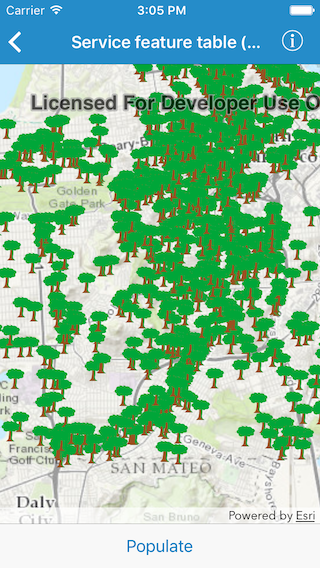

#Service feature table (manual cache)

This sample demonstrates how to use a feature service in manual cache mode.

##How it works

By setting the `featureRequestMode` to `AGSFeatureRequestMode.manualCache` on an `AGSServiceFeatureTable`.

