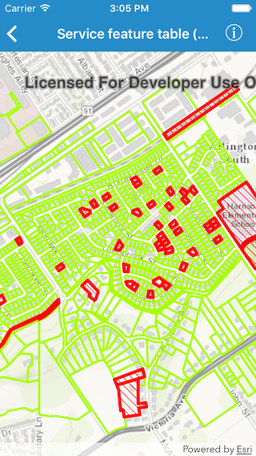

#Service feature table (no cache)

This sample demonstrates how to use a feature service in on interaction no cache mode.

##How it works

By setting the `featureRequestMode` to `AGSFeatureRequestMode.onInteractionNoCache` on an `AGSServiceFeatureTable`.
