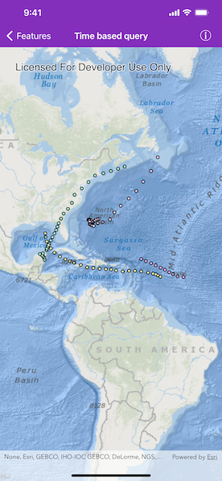

# Time based query

Query data using a time extent. 

## Use case

This workflow can be used to return records that are between a specified start and end date. For example, records of Canada goose sightings over time could be queried to only show sightings during the winter migration time period.

## How to use the sample

Run the sample, and a subset of records will be displayed on the map. Pan and zoom to explore.

## How it works

1. An instance of `AGSServiceFeatureTable` is created by passing a URL to the REST endpoint of a time-enabled service. Time-enabled services will have TimeInfo defined in the service description. This information is specified in ArcMap or ArcGIS Pro prior to publishing the service.
2. The `featureRequestMode` of the `ServiceFeatureTable` is set to `manualCache`, so that the developer can control how and when the feature table is populated with data.
3. An `AGSFeatureLayer` is created by passing in the instance of the `AGSServiceFeatureTable`.
4. An `AGSTimeExtent` object is created by specifying start and end date/time objects.
5. Apply the `AGSTimeExtent` to an `AGSQueryParmaters` object.
6. Pass the `AGSQueryParmaters` into `AGSServiceFeatureTable.populateFromService(with:clearCache:outFields:completion:)`.
7. The feature table is populated with data that matches the provided query.

## Relevant API

* AGSQueryParameters
* AGSServiceFeatureTable.populateFromService
* AGSTimeExtent

## About the data

This sample uses Atlantic hurricane data from the year 2000. The data is from the National Hurricane Center (NOAA / National Weather Service).

## Tags

query, time, time Extent
