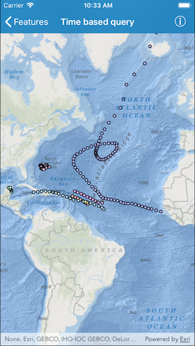

# Time based query

This sample demonstrates how to apply a time-based parameter to a feature layer query

## How it works

Create an instance of `AGSServiceFeatureTable` in manual cache mode, create a feature layer from the table and add it to the map's operational layers. Then create an instance of `AGSQueryParameters` and specify a time extent with a start and end time. Finally, use `populateFromService(with:clearCache:outFields)` method present on `AGSServiceFeatureTable` to populate features based on the specified time interval.

