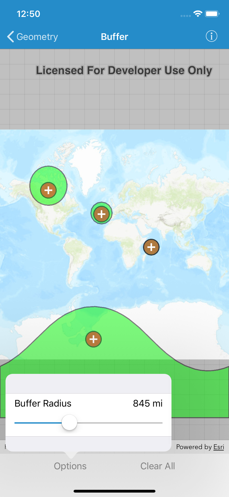

# Buffer

This sample demonstrates how to use `AGSGeometryEngine` to create polygons from a map location and linear distance (radius). For each input location, the sample creates two buffer polygons (using the same distance) and displays them on the map using different symbols. One polygon is calculated using the `planar` (projected) coordinate space of the map. The other is created using a `geodesic` technique that considers the curved shape of the Earth's surface. Distortion in the map increases as you move away from the standard parallels of the spatial reference's projection. This map uses the Web Mercator projection so areas near the equator are the most accurate. As you move the buffer location north or south from that latitude, you'll see a greater difference in the polygon size and shape. Planar operations are generally faster, but performance improvement may only be noticeable for large or complex buffer operations.

Creating buffers is a core concept in GIS proximity analysis, allowing you to visualize and locate geographic features contained within a polygon. For example, suppose you wanted to visualize areas of your city where alcohol sales are prohibited because they are within 500 meters of a school. The first step in this proximity analysis would be to generate 500 meter buffer polygons around all schools in the city. Any such businesses you find inside one of the resulting polygons are violating the law. If you are using planar buffers, make sure that the input locations and distance are suited to the spatial reference you're using. Remember that you can also create your buffers using geodesic and then project them to the spatial reference you need for display or analysis. For more information about using buffer analysis, see [How buffer analysis works](https://pro.arcgis.com/en/pro-app/tool-reference/analysis/how-buffer-analysis-works.htm) in the ArcGIS Pro documentation.  

## How to use the sample
1. Tap the map.    
2. Graphics for a planar buffer (brown) and geodesic buffer (green) are added for the tap location using the distance specified in the text box.
3. Continue tapping to create additional buffers. Notice that buffers closer to the equator appear similar in size. As you move north or south from the equator, however, the geodesic polygons become much larger. Geodesic polygons are in fact a better representation of the true shape and size of the buffer.   
4. Tap `Clear All` to remove all the graphics and start again.

## How it works
The map point for a tap on the display is captured and the specified buffer distance is converted to meters. The `AGSGeometryEngine` static method `bufferGeometry(_:byDistance:)` is called to create a planar buffer polygon from the map location and distance. Another static method, `geodeticBufferGeometry(_:distance:distanceUnit:maxDeviation:curveType:)` is called to create a geodesic buffer polygon using the same inputs. The polygon results (and tap location) are displayed in the map view with different symbols in order to highlight the difference between the buffer techniques due to the spatial reference used in the planar calculation.

## Relevant API
* `class AGSGeometryEngine.bufferGeometry(_:byDistance:)`
* `class AGSGeometryEngine.geodeticBufferGeometry(_:distance:distanceUnit:maxDeviation:curveType:)`
* `AGSGraphicsOverlay`

## Tags
Analysis
Buffer
GeometryEngine
