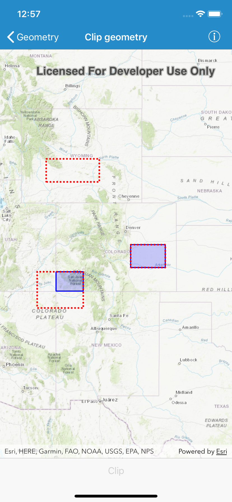

# Clip Geometry

This sample demonstrates how to clip a geometry with an envelope using `AGSGeometryEngine`.

## How to use the sample
Tap "Clip" to run clip operations between the red and blue outlines and display the results.

## How it works
1. Create an `AGSGraphicsOverlay` and add an `AGSGraphic` for the blue envelope.
2. Create another `AGSGraphicsOverlay` that contains red graphics for the three other envelopes: one intersecting part of the first graphic, one contained within it, and one completely outside it.
3. Upon button tap, iterate through the `graphics` of the `AGSGraphicsOverlay` that contains the three envelopes and call `class AGSGeometryEngine.clipGeometry(_:with:)` for each `AGSEnvelope`, passing in the blue graphic's geometry as the other argument.
4. Add each clipped `AGSGeometry` graphic result to a `AGSGraphicsOverlay` to visualize the clipped geometries.

## Relevant API
- `class AGSGeometryEngine.clipGeometry(_:with:)`
- `AGSGraphicsOverlay`
- `AGSGraphic`
- `AGSGeometry`
- `AGSEnvelope`
- `AGSSimpleLineSymbol`
- `AGSSimpleFillSymbol`

## Tags
Geometry, Clip, Geometry Engine
