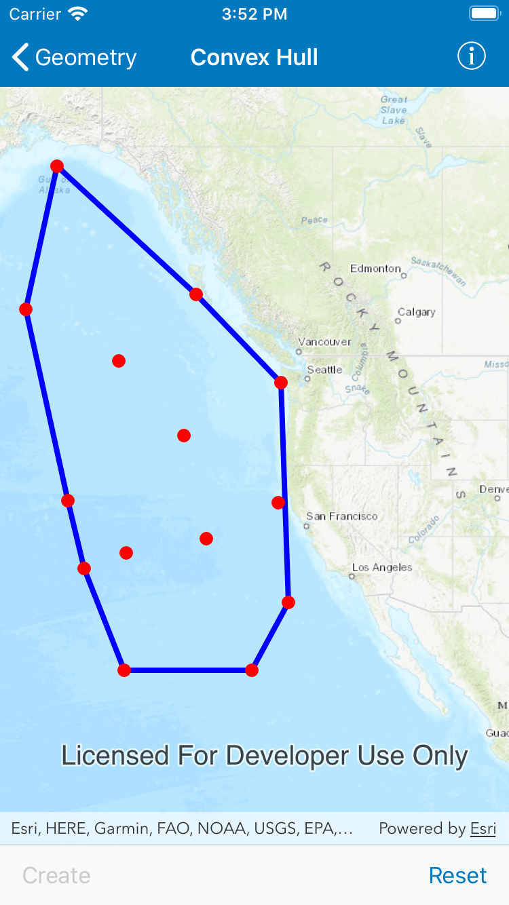

<!-- will need to take a look at the following parts
	1. API names,
	2. how it works terms
	3. implementaion details
-->

# Convex hull

Create a convex hull for a given set of points. The convex hull is a polygon with shortest perimeter that encloses a set of points. As a visual analogy, consider a set of points as nails in a board. The convex hull of the points would be like a rubber band stretched around the outermost nails.

## Use case

A convex hull can be useful in collision detection. For example, when charting the position of two yacht fleets (with each vessel represented by a point), if their convex hulls have been precomputed, it is efficient to first check if their convex hulls intersect before computing their proximity point-by-point.

## How to use the sample

Tap on the map to add points. Tap the "Create" button to generate the convex hull of those points. Tap the "Reset" button to start over.

## How it works

1. Create an input geometry such as a `Multipoint` object.
2. Use `AGSGeometryEngine.convexHull(inputGeometry)`to create a new `AGSGeometry` object representing the convex hull of the input points. The returned geometry will either be a `point`, `polyline`, or `polygon` based on the number of input points.

## Relevant API

* AGSGeometry
* AGSGeometryEngine
* AGSGraphic
* AGSGraphicsOverlay

## Tags

ConvexHull, Geometry, GeometryEngine, spatial analysis
