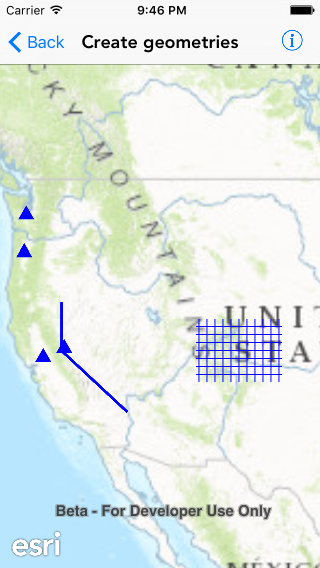

#Create geometries

This sample demonstrates simple ways to create different types of geometries.

##How it works

The geometries are added as `AGSGraphic` objects to a graphics overlay and displayed in a map view. The geometries are created using geometry builders. Geometry builders (or builders, for short) create or change geometry. A geometry builder contains the same things a geometry contains—vertices, segments, and parts—allowing its state to be changed as needed. You may create new geometries at any point from the builder’s current state. A builder is available for each type of geometry. Each builder exposes the appropriate methods for modifying a specific type of geometry. In the case of `AGSPolylineBuilder` and `AGSPolygonBuilder` that share many members, both inherit from `AGSMultipartBuilder`, which in turn inherits from `AGSGeometryBuilder`. Other builders inherit directly from `AGSGeometryBuilder`.

