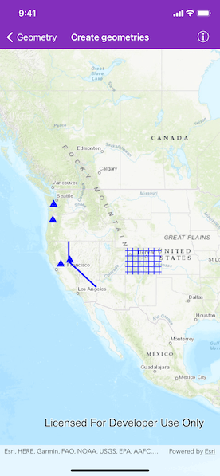

# Create geometries

Create simple geometry types.

## Use case

Geometries are used to represent real world features as vector GIS data. Points are used to mark specific XY locations, such as landmarks and other points of interest. Polylines are made up of 2 or more XY vertices and can be used to mark roads, flight paths, or boundaries. Polygons are made up of 3 or more XY vertices and can be used to represent a lake, country, or a park. Geometries can be stored as features in a database, displayed as graphics in a map, or used for performing spatial analysis with `AGSGeometryEngine` or an `AGSGeoprocessingTask`.

## How to use the sample

Pan and zoom freely to see the different types of geometries placed on the map.

## How it works

1. Use the constructors for the various simple `AGSGeometry` types including `AGSPoint`, `AGSPolyline`, `AGSMultipoint`, `AGSPolygon`, and `AGSEnvelope`.
2. To display the geometry, create an `AGSGraphic` passing in the geometry, and an `AGSSymbol` appropriate for the geometry type.
3. Add the graphic to an `AGSGraphicsOverlay` and add the overlay to an `AGSMapView`.

## Relevant API

* AGSEnvelope
* AGSMultipoint
* AGSPoint
* AGSPolygon
* AGSPolyline

## Tags

area, boundary, line, marker, path, shape
