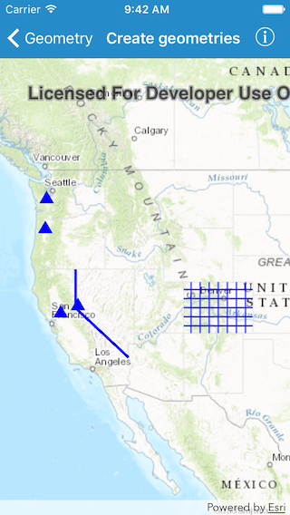

#Create geometries

This sample demonstrates simple ways to create different types of geometries.

##How it works

The geometries are added as `AGSGraphic` objects to a graphics overlay and displayed in a map view. An `AGSEnvelope` is used to set the viewpoint of a map view.

