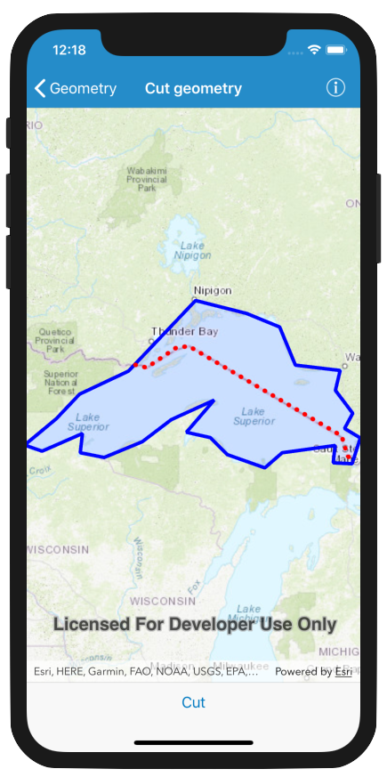

# Cut geometry

This sample demonstrates how to cut a geometry with a polyline using the `AGSGeometryEngine`. For example, you may want to subdivide a large parcel polygon into several smaller parcels.

## How to use the sample
Press the `Cut` button, and the solid blue polygon will be cut into two polygons - a yellow and a green polygon with a diagonal pattern.

## How it works
The `AGSGeometryEngine.cut(_:withCutter:)` method is executed with the polygon as the first parameter and the cutting line as the second parameter. This returns a list of geometries. Each geometry is added as a new `AGSGraphic` with differing fill symbols to visualize the results.

## Relevant API
 - `AGSGeometryEngine`
 - `AGSGeometryEngine.cut(_:withCutter:)`

## Tags
geometry, cut, split