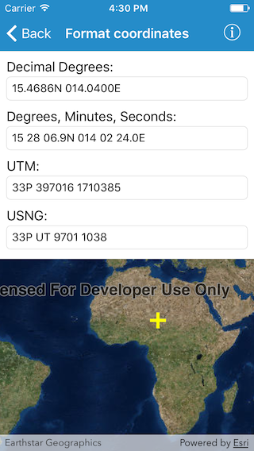

# Format coordinates

Coordinates can be written and formatted in different ways, for example latitude, longitude coordinates can be formatted as decimal degrees, or degrees, minutes, and seconds. This sample demonstrates how to convert a map location Point in WGS 1984 spatial reference to a number of different coordinate notations (decimal degrees; degrees, minutes, seconds; Universal Transverse Mercator (UTM), and United States National Grid (USNG)), by using CoordinateFormatter. Additionally, coodinate notation strings can be converted to a Point and shown in the map by tapping on the notation values shown and entering a coordinate in the appropriate notation.

The CoordinateFormatter also supports Military Grid Reference System (MGRS), Global Area Reference System (GARS), and World Geographic Reference System (GEOREF) notations, using similar methods to those shown in this sample app.

## How to use the sample

Tap on the map to get coordinates for the tapped location. You can also edit the text in one of the textfields and hit return to update the graphic on map and get the other coordinate notations.

## How it works

The sample uses the `AGSCoordinateFormatter` class to create coordinate notations for provided location and vice versa. Following are the methods being used in the sample.

* `latitudeLongitudeString(from:format:decimalPlaces:)`
* `utmString(from:conversionMode:addSpaces:)`
* `usngString(from:precision:addSpaces:)`
* `point(fromLatitudeLongitudeString:spatialReference:)`
* `point(fromUTMString:spatialReference:conversionMode:)`
* `point(fromUSNGString:spatialReference:)`
