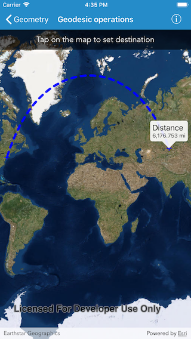

# Geodesic operations

This sample demonstrates how to use `AGSGeometryEngine` to calculate a geodesic path between two points and measure its distance. Geodesic calculations take into account the curvature of the Earth, while planar calculations are based on a 2D Cartesian plane.

Visualizing flight paths between cities is a common example of a geodesic operation.

## How to use the sample

1. Tap on the map to select destination of a path from the origin JFK Airport, NY.
2. A line graphic will display the geodesic path between origin and destination.
3. The geodesic distance of the path will display in map view's callout.

## How it works

1. Create an instance of `AGSPolyline` using two points.
2. Densify the Polyline using the `geodeticDensifyGeometry(_:maxSegmentLength:lengthUnit:curveType:)` method on `AGSGeometryEngine`. This method will return a geodetically densified geometry.
3. Set this geometry to a Graphic to display the geodesic path between two points in a Graphics Overlay.
4. Get the geodetic distance of the path using the `geodeticLength(of:lengthUnit:curveType:)` method on `AGSGeometryEngine`.

## Relevant API

- AGSGeometry
- AGSGeometryEngine
- AGSGraphic
- AGSGraphicsOverlay

## Tags

GeometryEngine, Densify, Distance, Geodetic, Geodesic
