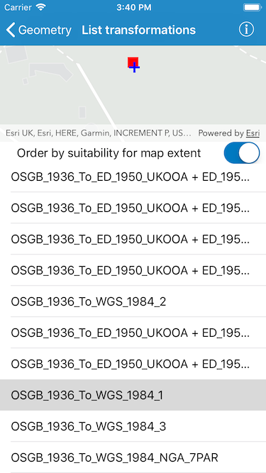

# List transformations by suitability

Transformations (sometimes known as datum or geographic transformations) are used when projecting data from one spatial reference to another, when there is a difference in the underlying datum of the spatial references. Transformations can be mathematically defined by specific equations (equation-based transformations), or may rely on external supporting files (grid-based transformations). Choosing the most appropriate transformation for a situation can ensure the best possible accuracy for this operation. Some users familiar with transformations may wish to control which transformation is used in an operation.

This sample demonstrates how to use the `AGSTransformationCatalog` to get a list of available `AGSDatumTransformation` that can be used to project an `AGSGeometry` between two different `AGSSpatialReference`, and how to use one of the transformations to perform the `AGSGeometryEngine.project` operation. The `AGSTransformationCatalog` is also used to set the location of files upon which grid-based transformations depend, and to find the default transformation used for the two `AGSSpatialReference`.

## How to use the sample
Optionally, begin by adding projection engine data to your device before running this sample. When you provision projection engine data to your device, more transformations are available for use.

Tap on a listed transformation to reproject the point geometry (shown in red) using the selected transformation. The reprojected geometry will be shown in blue. If there are grid-based transformations for which projection engine files are not available on your device, these will be listed in an items details. The default transformation is highlighted in the list.

## How it works
The sample sets the location of projection engine data on the device by calling `AGSTransformationCatalog.setProjectionEngineDirectory`.

The list of `AGSDatumTransformation` objects is created by calling `AGSTransformationCatalog.transformationsBySuitability`, passing in the `AGSSpatialReference` of the original geometry (the input spatial reference) and that of the `AGSMap` (the output spatial reference). Depending on the state of a switch control, the current visible extent of the map is used to sort the list by suitability.

When the user taps on a transformation in the list, the selected transformation is used to reproject an `AGSPoint`. The `AGSGraphic`'s geometry is then updated with the new `AGSPoint`. If the selected transformation is not usable (has missing grid files) then no projected point is displayed.

## Relevant API
* AGSTransformationCatalog
* AGSDatumTransformation
* AGSGeographicTransformation
* AGSGeographicTransformationStep
* AGSGeometryEngine.project

## Offline data
This sample can be used with or without provisioning projection engine data to your device.  If you do not provision data, a limited number of transformations will be available to you.

To download projection engine data to your device:

1. Log in to the ArcGIS for Developers site using your Developer account.
2. In the Dashboard page, click 'Download APIs and SDKs'.
3. Click the download button next to 'ArcGIS_Runtime_Coordinate_System_Data' to download projection engine data to your computer.
4. Unzip the downloaded data on your computer.
5. Use iTunes to copy the `PEDataRuntime` folder to your application's Documents folder.
  
## Tags
Edit and Manage Data
