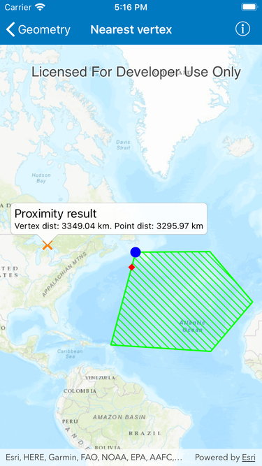

# Nearest vertex

Find the closest vertex and coordinate of a geometry to a point.

## Use case

Determine the shortest distance between a location and the boundary of an area. For example, developers can snap imprecise user taps to a geometry if the tap is within a certain distance of the geometry.

## How to use the sample

Tap anywhere on the map. An orange cross will show at that location. A blue circle will show the polygon's nearest vertex to the point that was tapped. A red diamond will appear at the coordinate on the geometry that is nearest to the point that was tapped. If tapped inside the geometry, the red and orange markers will overlap. The information box showing distance between the tapped point and the nearest vertex/coordinate will be updated with every new location tapped.

## How it works

1. Get a `AGSGeometry` and a `AGSPoint` to check the nearest vertex against.
2. Call `AGSGeometryEngine.nearestVertex(in: inputGeometry, to: mapPoint)`.
3. Use the returned `AGSProximityResult` to get the `AGSPoint` representing the polygon vertex, and to determine the distance between that vertex and the tapped point.
4. Call `AGSGeometryEngine.nearestCoordinate(in: inputGeometry, to: mapPoint)`.
5. Use the returned `AGSProximityResult` to get the `AGSPoint` representing the coordinate on the polygon, and to determine the distance between that coordinate and the tapped point.

## Relevant API

* AGSGeometry
* AGSGeometryEngine
* AGSProximityResult

## Tags

analysis, coordinate, geometry, nearest, proximity, vertex