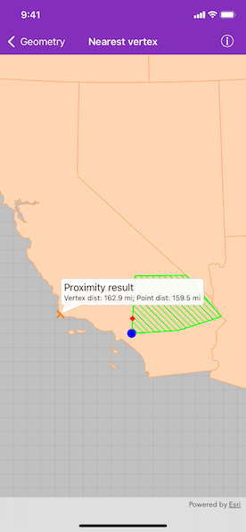

# Nearest vertex

Find the closest vertex and coordinate of a geometry to a point.

## Use case

Determine the shortest distance between a location and the boundary of an area. For example, developers can snap imprecise user taps to a geometry if the tap is within a certain distance of the geometry.

## How to use the sample

Tap anywhere on the map. An orange cross will show at that location. A blue circle will show the polygon's nearest vertex to the point that was tapped. A red diamond will appear at the coordinate on the geometry that is nearest to the point that was tapped. If tapped inside the geometry, the red and orange markers will overlap. Tap again to dismiss the callout. The information callout showing distance between the tapped point and the nearest vertex/coordinate will be updated with every new location tapped.

## How it works

1. Get an `AGSGeometry` and an `AGSPoint` to check the nearest vertex against.
2. Call `class AGSGeometryEngine.nearestVertex(in:to:)`.
3. Use the returned `AGSProximityResult` to get the `AGSPoint` representing the polygon vertex, and to determine the distance between that vertex and the tapped point.
4. Call `class AGSGeometryEngine.nearestCoordinate(in:to:)`.
5. Use the returned `AGSProximityResult` to get the `AGSPoint` representing the coordinate on the polygon, and to determine the distance between that coordinate and the tapped point.

## Relevant API

* AGSGeometry
* AGSProximityResult
* class AGSGeometryEngine.geodeticDistanceBetweenPoint1(_:point2:distanceUnit:azimuthUnit:curveType:)
* class AGSGeometryEngine.nearestCoordinate(in:to:)
* class AGSGeometryEngine.nearestVertex(in:to:)
* class AGSGeometryEngine.normalizeCentralMeridian(of:)

## Additional information

The `distance` property in `ProximityResult` is planar (Euclidean) distance. Planar distance only works for geometries that have a defined projected coordinate system, which preserves distance and length. The geometries in this demo are defined in Web Mercator, which doesn't preserve distance. Hence we need to use the geodetic distance APIs to get the accurate distances.

Because the Web Mercator Auxiliary Sphere (WKID 3857) projected coordinate system is so common in web maps and it heavily distorts both area and length measurements, all geodetic measurement APIs were designed to allow geometries with Web Mercator spatial references as input. This allows you to measure geoemtries accurately in Web Mercator without having to project them to a different coordinate system.

## Tags

analysis, coordinate, geometry, nearest, proximity, vertex
