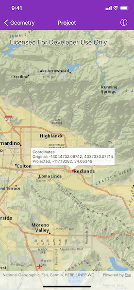

# Project

Project a point to another spatial reference.

## Use case

Being able to project between spatial references is fundamental to a GIS. An example of when you would need to re-project data is if you had data in two different spatial references, but wanted to perform an intersect analysis with the `class AGSGeometryEngine.intersection(ofGeometry1:geometry2:)` method. This method takes two geometries as parameters, and both geometries must be in the same spatial reference. If they are not, you could first use `class AGSGeometryEngine.projectGeometry(_:to:)` to convert the geometries so they match.

## How to use the sample

Tap anywhere on the map. A callout will display the tapped location's coordinate in the original (basemap's) spatial reference `webMercator` and in the projected spatial reference `wgs84`.

## How it works

1. Call the static method, `class AGSGeometryEngine.projectGeometry(_:to:)` passing in the original geometry and a spatial reference to which it should be projected.

## Relevant API

* AGSGeometryEngine
* AGSPoint
* AGSSpatialReference

## Additional information

In cases where the the output spatial reference uses a different geographic coordinate system than that of the input spatial reference, see the `class AGSGeometryEngine.projectGeometry(_:to:datumTransformation:)` method.

## Tags

AGSGeometryEngine, projection, spatial reference, Web Mercator, WGS 84, latitude, longitude, projected coordinate system, geographic coordinate system
