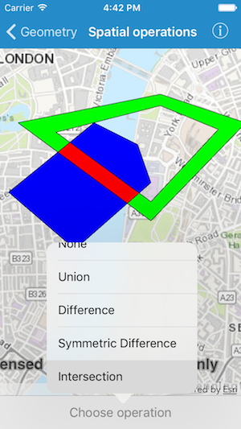

# Spatial operations

This sample demonstrates how to perform geometry operations between overlapping polygons.

## How to use the sample

Pick an operation from the list on the side. The resulting geometry is shown in red.

## How it works

The sample creates two overlapping polygons using `AGSPolygonBuilder` class. Adds them as graphics to the graphics overlay. These polygons are used for performing all the spatial operations. For each operation, a method on `AGSGeometryEngine` is called with the two polygons as input. The resulting geometry is added as a red colored graphic to the overlay. The methods used are as follows:

- union(ofGeometry1:geometry2:)
- difference(ofGeometry1:geometry2:)
- symmetricDifference(ofGeometry1:geometry2:)
- intersection(ofGeometry1:geometry2:)
