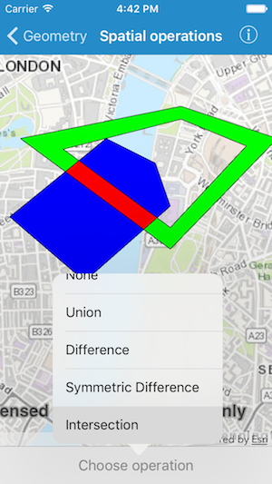

# Perform spatial operations

Find the union, intersection, or difference of two geometries.

## Use case

The different spatial operations (union, difference, symmetric difference, and intersection) can be used for a variety of spatial analyses. For example, government authorities may use the intersect operation to determine whether a proposed road cuts through a restricted piece of land such as a nature reserve or a private property.

When these operations are chained together, they become even more powerful. An analysis of food deserts within an urban area might begin by union-ing service areas of grocery stores, farmer's markets, and food co-ops. Taking the difference between this single geometry of all services areas and that of a polygon delineating a neighborhood would reveal the areas within that neighborhood where access to healthy, whole foods may not exist.

## How to use the sample

The sample provides an option to select a spatial operation. When an operation is selected, the resulting geometry is shown in red.

## How it works

1.  Create a `AGSGraphicsOverlay` and add it to the `AGSMapView`.
2.  Create each polygon `AGSGeometry` using `AGSPolygonBuilder`.
3.  Add the overlapping polygons to the graphics overlay.
4.  Perform spatial relationships between the polygons by using the appropriate operation:
    * `class AGSGeometryEngine.union(ofGeometry1:geometry2:)` - This method returns the two geometries united together as one geometry.
    * `class AGSGeometryEngine.difference(ofGeometry1:geometry2:)` - This method returns any part of Geometry2 that does not intersect Geometry1.
    * `class AGSGeometryEngine.symmetricDifference(ofGeometry1:geometry2:)` - This method returns any part of Geometry1 or Geometry2 which do not intersect.
    * `class AGSGeometryEngine.intersection(ofGeometry1:geometry2:)` - This method returns the intersection of Geometry1 and Geometry2.
5. Use the geometry that is returned from the method call to create a new `AGSGraphic` and add it to the graphics overlay for it to be displayed.

## Relevant API

* class AGSGeometryEngine.union(ofGeometry1:geometry2:)
* class AGSGeometryEngine.difference(ofGeometry1:geometry2:)
* class AGSGeometryEngine.symmetricDifference(ofGeometry1:geometry2:)
* class AGSGeometryEngine.intersection(ofGeometry1:geometry2:)
* AGSGeometry
* AGSGeometryEngine
* AGSGraphic
* AGSGraphicsOverlay

## Tags

analysis, combine, difference, geometry, intersection, merge, polygon, union
