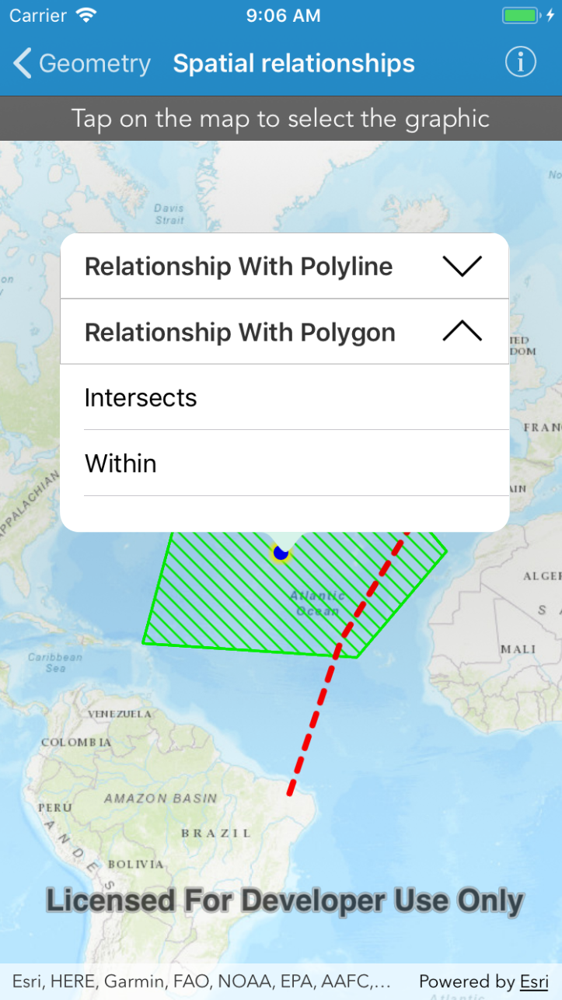

# Spatial relationships

This sample demonstrates how to use the `AGSGeometryEngine` to evaluate the spatial relationships between geometries.

## How to use the sample
Tap on the map to select the graphic and its geometry will be used to check the spatial relationships with other graphics geometries. The result will be displayed in the popover.

## How it works
The `AGSGeometryEngine`'s `geometry(_:crossesGeometry:)`, `geometry(_:contains:)`, `geometry(_:disjointTo:)`, `geometry(_:intersects:)`, `geometry(_:overlapsGeometry:)`, `geometry(_:touchesGeometry:)` and `geometry(_:within:)` methods are executed with selected graphic's geometry and other non-selected graphics geometries. If the method returns `true`, the relationship exists.

## Relevant API
- `AGSGeometryEngine`
- `AGSGeometryEngine.geometry(_:crossesGeometry:)`
- `AGSGeometryEngine.geometry(_:contains:)`
- `AGSGeometryEngine.geometry(_:disjointTo:)`
- `AGSGeometryEngine.geometry(_:intersects:)`
- `AGSGeometryEngine.geometry(_:overlapsGeometry:)`
- `AGSGeometryEngine.geometry(_:touchesGeometry:)`
- `AGSGeometryEngine.geometry(_:within:)`

## Tags
geometry, spatial relationship, crosses, contains, disjoint, intersects, overlaps, touches, within
