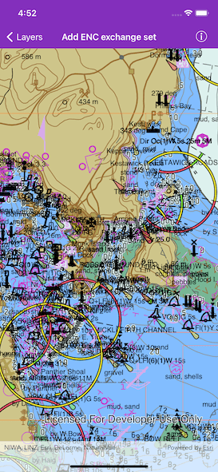

# Add ENC exchange set

Display nautical charts per the ENC specification.

## Use case

The [ENC specification](https://docs.iho.int/iho_pubs/standard/S-57Ed3.1/20ApB1.pdf) describes how hydrographic data should be displayed digitally.

An ENC exchange set is a catalog of data files which can be loaded as cells. The cells contain information on how symbols should be displayed in relation to one another, so as to represent information such as depth and obstacles accurately.

## How to use the sample

When launched, the sample displays the ENC data. Take note of the high level of detail in the data and the smooth rendering of the layer.

## How it works

1. Specify the path to a local *CATALOG.031* file to create an `AGSENCExchangeSet`.
2. After loading the exchange set, get the `AGSENCDataset` objects in the exchange set from its `datasets` property.
3. Create an `AGSENCCell` for each dataset. Then create an `AGSENCLayer` for each cell.
4. Add the ENC layers to the map's operational layers collection to display it.

## Relevant API

* AGSENCCell
* AGSENCDataset
* AGSENCExchangeSet
* AGSENCLayer

## Offline data

This sample downloads the [ENC Exchange Set without updates](https://www.arcgis.com/home/item.html?id=9d2987a825c646468b3ce7512fb76e2d) item from *ArcGIS Online*.

The latest [hydrography package](https://developers.arcgis.com/downloads/data) can be downloaded from *ArcGIS for Developers* (login is required). The *S57DataDictionary.xml* file is contained in it along with many others but a user does not need to know that in order to render ENC data.

## Additional information

Read more about [Display electronic navigational charts](https://developers.arcgis.com/ios/latest/swift/guide/display-electronic-navigational-charts.htm) on *ArcGIS for Developers*.

## Tags

data, ENC, hydrographic, layers, maritime, nautical chart
